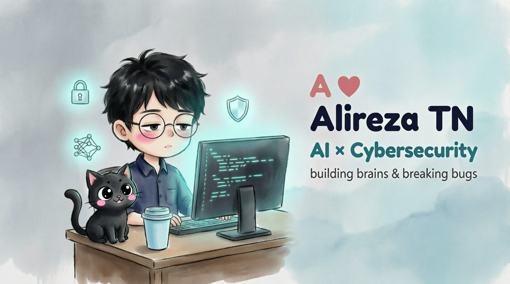

  

<h1 align="center">👋 Hi, I'm Alireza TN</h1>

  <strong>🐍 Python Backend Developer | 🔐 Cybersecurity | 🤖 AI Security</strong>

  Building secure, practical, and reliable software systems.

---

<h2 align="center">🎯 My Direction</h2>

  <strong>
    Python → Backend Engineering → Networking & Linux → Cybersecurity → AI Security
  </strong>

  I'm continuously learning, building, and experimenting with technologies that combine
  <strong>software engineering, cybersecurity, and artificial intelligence.</strong>

---

<h2 align="center">🛠️ Tech Stack</h2>

<h3 align="center">🐍 Programming Languages</h3>

  

<h3 align="center">⚙️ Backend & Databases</h3>

  

<h3 align="center">🐧 Systems & Tools</h3>

  

<h3 align="center">🌐 Web Technologies</h3>

  

<h3 align="center">🤖 AI & Machine Learning</h3>

  

  <i>
    My primary focus is Python backend development, networking,
    Linux, cybersecurity, and AI security.
  </i>

---

<h2 align="center">🔐 Areas of Interest</h2>

  🔐 Cybersecurity &nbsp; • &nbsp;
  🌐 Network Security &nbsp; • &nbsp;
  🐧 Linux &nbsp; • &nbsp;
  🤖 AI Security

  <strong>Build → Break → Understand → Secure</strong>

---

<h2 align="center">🚀 Featured Projects</h2>

  A selection of projects focused on backend development,
  networking, cybersecurity, and practical Python engineering.

| Project | Description | Technologies |
|:---:|:---|:---:|
| ⚡ **[Task Management API](https://github.com/Alireza-TN/Task-Management-API)** | RESTful backend API designed for task management and structured backend development. |    |
| 🌐 **[Local Network Scanner](https://github.com/Alireza-TN/local-network-scanner)** | Network scanning tool built around Python networking and socket programming concepts. |   |
| 🔐 **[Secure Password Manager](https://github.com/Alireza-TN/secure-password-manager)** | Secure password management application focused on encryption and secure data handling. |   |
| 💰 **[Smart Expense Tracker](https://github.com/Alireza-TN/smart-expense-tracker)** | Python expense tracking application built with OOP principles and SQLite. |   |

   
  <strong>🔗 Explore all my projects on GitHub</strong>
    
  

---

<h2 align="center">🧠 What I Build</h2>

  🔧 Backend Systems &nbsp; • &nbsp;
  🌐 Network Tools &nbsp; • &nbsp;
  🔐 Security-Focused Software &nbsp; • &nbsp;
  🐍 Python Applications

  <strong>Build → Break → Understand → Secure</strong>

